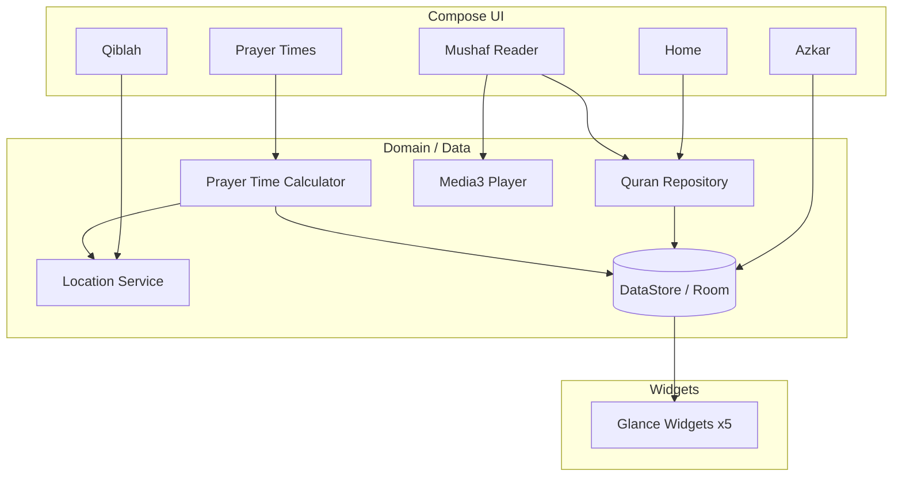

# Tanweer (تنوير) — Android

A Kotlin + Jetpack Compose port of Tanweer, built for pixel parity with the iOS app —
same Mushaf typesetting, same prayer time and Qiblah logic, same widget set, ported
screen-by-screen against the original as a living spec.

> This repository is a portfolio case study. The app is closed-source; screenshots,
> architecture notes, and engineering write-ups live here so the work can be reviewed
> without exposing the codebase.

Not yet published to the Play Store — currently in final release-signing and QA passes.

## Screenshots

  
  
  
  

## Tech Stack

- **Kotlin, Jetpack Compose** — fully declarative UI, no XML layouts
- **Hilt** — dependency injection across managers/repositories and the Glance widgets
- **Glance** — 5 home-screen widgets sharing the same data layer as the app
- **Gradle version catalogs** — centralized dependency versions across app + widget modules
- **CoreLocation-equivalent (`FusedLocationProviderClient`)** — Qiblah bearing and prayer-time geolocation
- **Media3** — Quran recitation playback with background audio support
- **Release signing pipeline** — keystore-based signing config with an environment-variable fallback for CI, so `assembleRelease` produces a signed build without committing secrets

## Architecture

Hilt wires repositories and services into both the Activity-hosted Compose tree and
the Glance widget receivers, so widgets and the app read from the same source of
truth instead of duplicating state.

## Engineering Highlights

**Porting for pixel parity, not just feature parity.** The iOS app was treated as the
spec: every screen was rebuilt against it for exact spacing, type scale, and behavior
rather than reinterpreted "in the spirit of" the original. That discipline is what
surfaced most of the bugs below — they only showed up once behavior was compared
frame-by-frame against a working reference.

**A widget crash that only reproduced at render time, not compile time.** All 5 Glance
home-screen widgets were passing raw `Int` literals to `.padding()` / `.height()` /
`.width()`. Glance resolves a bare `Int` to the `@DimenRes` resource-ID overload, not
`dp` — so every widget compiled cleanly and then crashed with
`Resources.NotFoundException` the instant it rendered. The compiler had no way to
warn about it; only Android Lint's `ResourceType` check caught it, across all 5
widgets at once.

**An RTL ayah-badge bug identical to the iOS one, hit independently on a different
platform.** Same HAFS font, same `calt` contextual-alternates limitation to 1–2 digit
runs — any 3-digit ayah number (100+) rendered as garbled or dropped digits. Diagnosed
by pulling `adb exec-out screencap` frames and inspecting pixel regions rather than
guessing from the font's substitution tables, and fixed the same way as iOS: draw the
ornate circle and the digits as two separate draw calls for 3+ digit badges, with the
digits in a plain typeface with no Quranic ligature rules.

**Locale-aware number formatting, forced.** The playback-speed label used
`String.format` without a `Locale`, so on an Arabic or Urdu device it silently
rendered Arabic-Indic digits and a different decimal separator inside what's meant to
be a plain "1.5x" UI label. Pinned to `Locale.US` for that one label rather than the
device locale.

**A drag gesture that died on relayout.** The premium audio scrubber's
`pointerInput` was keyed on the scrubber's measured size — so a mid-drag relayout
(e.g. text reflow while scrubbing) recreated the pointer input handler and silently
ate the touch-up event, leaving the drag stuck. Fixed by decoupling the gesture key
from layout-dependent state so a relayout mid-gesture no longer cancels it.

## More from this developer

- [Tanweer for iOS](https://github.com/lqji/tanweer-ios-showcase) — the original, native Swift/SwiftUI app
- [Type Faster](https://github.com/lqji/type-faster-showcase) — a typing test with real-time multiplayer racing
- [Full portfolio →](https://github.com/lqji/portfolio)

---

Built and maintained by **Ahmed Abdullah**.
