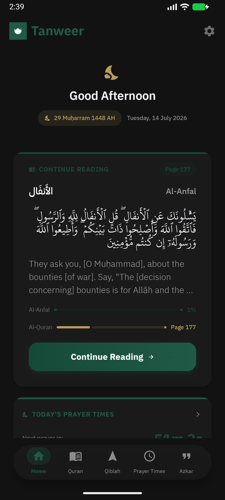
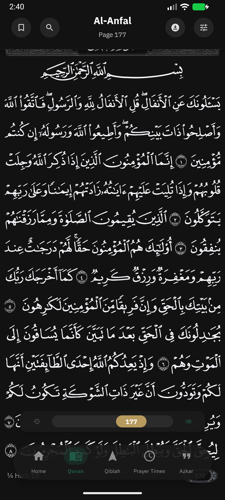
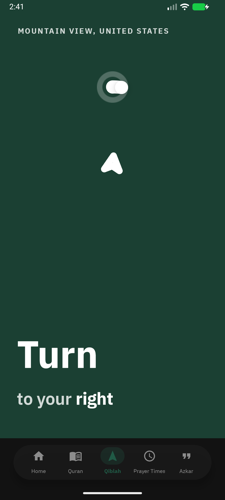
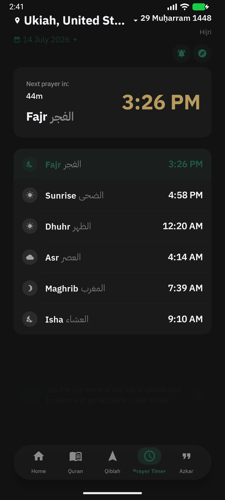
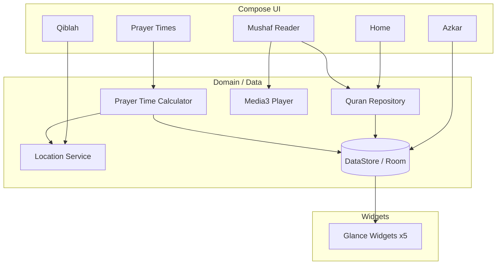

# Tanweer (تنوير) — Android

A Kotlin + Jetpack Compose port of Tanweer, built for pixel parity with the iOS app —
same Mushaf typesetting, same prayer time and Qiblah logic, same widget set, ported
screen-by-screen against the original as a living spec.

> This repository is a portfolio case study. The app is closed-source; screenshots,
> architecture notes, and engineering write-ups live here so the work can be reviewed
> without exposing the codebase.

Not yet published to the Play Store — currently in final release-signing and QA passes.

## Screenshots

  
  
  
  

## Tech Stack

- **Kotlin, Jetpack Compose** — fully declarative UI, no XML layouts
- **Hilt** — dependency injection across managers/repositories and the Glance widgets
- **Glance** — 5 home-screen widgets sharing the same data layer as the app
- **Gradle version catalogs** — centralized dependency versions across app + widget modules
- **CoreLocation-equivalent (`FusedLocationProviderClient`)** — Qiblah bearing and prayer-time geolocation
- **Media3** — Quran recitation playback with background audio support
- **Release signing pipeline** — keystore-based signing config with an environment-variable fallback for CI, so `assembleRelease` produces a signed build without committing secrets

## Architecture

Hilt wires repositories and services into both the Activity-hosted Compose tree and
the Glance widget receivers, so widgets and the app read from the same source of
truth instead of duplicating state.
